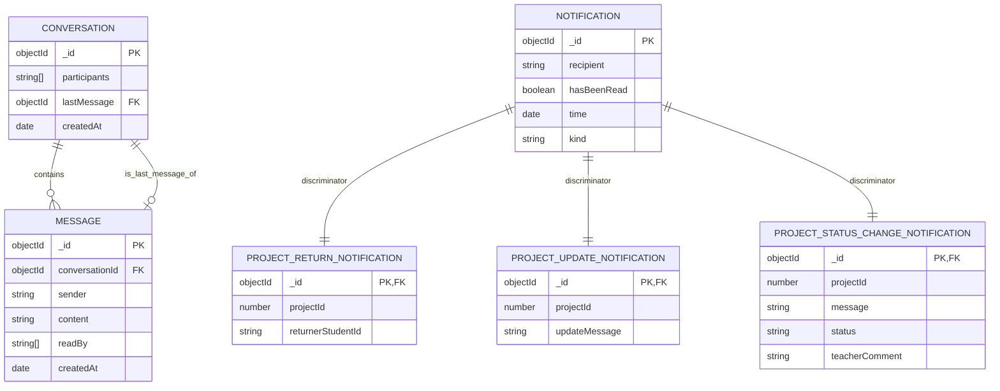

# ER Diagram

Tama dokumentti kuvaa projektin tietovarastot korkealla tasolla.

- PostgreSQL: paadomainin relaatiomalli Prisma-schemasta
- MongoDB: viestit ja ilmoitukset
- Redis: pub/sub-valitys, ei varsinainen relaatio- tai dokumenttimalli

## PostgreSQL

```mermaid
erDiagram
    USER {
        int id PK
        string email UK
        string oid UK
        string scope
        boolean archived
        boolean isSetUp
    }

    STUDENT {
        int userId PK, FK
        int qualificationId FK
        int qualificationTitleId FK
        int studentGroupId FK
        string qualificationCompletion
    }

    TEACHER {
        int userId PK, FK
        int teachingQualificationId
        int teachingQualificationTitleId
    }

    JOB_SUPERVISOR {
        int userId PK, FK
        int workplaceId FK
    }

    STUDENT_GROUP {
        int id PK
        string groupName UK
    }

    QUALIFICATION {
        int id PK
        string name
    }

    QUALIFICATION_TITLE {
        int id PK
        int qualificationId FK
        string name
    }

    QUALIFICATION_UNIT {
        int id PK
        int qualificationId FK
        string name
        int scope
    }

    QUALIFICATION_UNIT_PART {
        int id PK
        int qualificationUnitId FK
        string name
        int unitOrderIndex
    }

    QUALIFICATION_PROJECT {
        int id PK
        string name
        boolean isActive
        int duration
    }

    QUALIFICATION_PROJECT_TAG {
        int id PK
        string name
    }

    QUALIFICATION_PROJECTS_PARTS_RELATION {
        int qualificationProjectId PK, FK
        int qualificationUnitPartId PK, FK
        int partOrderIndex
    }

    QUALIFICATION_PROJECTS_TAGS_RELATION {
        int qualificationProjectId PK, FK
        int qualificationProjectTagId PK, FK
    }

    QUALIFICATION_COMPETENCE_REQUIREMENTS {
        int id PK
        int qualificationUnitId FK
        string title
    }

    QUALIFICATION_COMPETENCE_REQUIREMENT {
        int id PK
        int groupId FK
        int qualificationProjectId FK
        string description
    }

    MANDATORY_QUALIFICATION_UNITS_FOR_TITLE {
        int unitId PK, FK
        int titleId PK, FK
    }

    ASSIGNED_QUALIFICATION_UNITS_FOR_STUDENT {
        int studentId PK, FK
        int qualificationUnitId FK
    }

    ASSIGNED_PROJECTS_FOR_STUDENT {
        int studentId PK
        int projectId PK, FK
        int studentUserId FK
        date startDate
        date deadlineDate
        string projectStatus
    }

    WORKTIME_ENTRIES {
        int id PK
        int studentId FK
        int projectId FK
        date startDate
        date endDate
    }

    WORKPLACE {
        int id PK
        string name
    }

    INTERNSHIP {
        int id PK
        int workplaceId FK
        int teacherUserId FK
        int studentUserId FK
        int jobSupervisorUserId FK
        int qualificationUnitId FK
        date startDate
        date endDate
    }

    SUPERVISED_STUDENTS_BY_JOB_SUPERVISOR {
        int id PK
        int studentId FK
        int jobSupervisorId FK
    }

    MAGIC_LINK_TOKEN {
        string id PK
        string email UK
        string tokenHash
        date expiresAt
        boolean used
    }

    USER ||--o| STUDENT : "is"
    USER ||--o| TEACHER : "is"
    USER ||--o| JOB_SUPERVISOR : "is"

    STUDENT_GROUP ||--o{ STUDENT : "contains"
    STUDENT_GROUP }o--o{ TEACHER : "assigned"

    QUALIFICATION ||--o{ QUALIFICATION_TITLE : "has"
    QUALIFICATION ||--o{ QUALIFICATION_UNIT : "has"

    QUALIFICATION_TITLE ||--o{ MANDATORY_QUALIFICATION_UNITS_FOR_TITLE : "requires"
    QUALIFICATION_UNIT ||--o{ MANDATORY_QUALIFICATION_UNITS_FOR_TITLE : "belongs"

    QUALIFICATION_UNIT ||--o{ QUALIFICATION_UNIT_PART : "has"
    QUALIFICATION_UNIT ||--o{ QUALIFICATION_COMPETENCE_REQUIREMENTS : "defines"
    QUALIFICATION_COMPETENCE_REQUIREMENTS ||--o{ QUALIFICATION_COMPETENCE_REQUIREMENT : "contains"

    QUALIFICATION_PROJECT ||--o{ QUALIFICATION_PROJECTS_PARTS_RELATION : "maps"
    QUALIFICATION_UNIT_PART ||--o{ QUALIFICATION_PROJECTS_PARTS_RELATION : "maps"

    QUALIFICATION_PROJECT ||--o{ QUALIFICATION_PROJECTS_TAGS_RELATION : "tagged"
    QUALIFICATION_PROJECT_TAG ||--o{ QUALIFICATION_PROJECTS_TAGS_RELATION : "used_in"

    QUALIFICATION_PROJECT ||--o{ QUALIFICATION_COMPETENCE_REQUIREMENT : "targets"

    STUDENT ||--o| ASSIGNED_QUALIFICATION_UNITS_FOR_STUDENT : "assigned_unit"
    QUALIFICATION_UNIT ||--o{ ASSIGNED_QUALIFICATION_UNITS_FOR_STUDENT : "assigned_to"

    STUDENT ||--o{ ASSIGNED_PROJECTS_FOR_STUDENT : "works_on"
    QUALIFICATION_PROJECT ||--o{ ASSIGNED_PROJECTS_FOR_STUDENT : "assigned"
    ASSIGNED_PROJECTS_FOR_STUDENT ||--o{ WORKTIME_ENTRIES : "tracked_by"

    WORKPLACE ||--o{ JOB_SUPERVISOR : "has"
    WORKPLACE ||--o{ INTERNSHIP : "hosts"
    STUDENT ||--o{ INTERNSHIP : "has"
    TEACHER ||--o{ INTERNSHIP : "supervises"
    JOB_SUPERVISOR ||--o{ INTERNSHIP : "guides"
    QUALIFICATION_UNIT ||--o{ INTERNSHIP : "for_unit"

    STUDENT ||--o{ SUPERVISED_STUDENTS_BY_JOB_SUPERVISOR : "linked"
    JOB_SUPERVISOR ||--o{ SUPERVISED_STUDENTS_BY_JOB_SUPERVISOR : "linked"

    TEACHER }o--o{ QUALIFICATION_PROJECT : "teaches"
    TEACHER }o--o{ QUALIFICATION_UNIT : "teaches"
    TEACHER }o--o{ QUALIFICATION_PROJECT_TAG : "filters"
```

## MongoDB

## Redis

Redisia kaytetaan pub/sub-kanaviin, ei pysyvaksi domain-datavarastoksi.

Keskeiset kanavat koodin perusteella:

- `notification`
- `new_message`
- `message_received`
- `get_conversations`
- `conversations_response`
- `get_messages`
- `messages_response`
- `create_conversation`
- `conversation_created`

## Lahteet

- [schema.prisma](/Users/purot/ossi/ossi-api/prisma-orm/prisma/schema.prisma)
- [message.ts](/Users/purot/ossi/ossi-api/messaging-server/src/models/message.ts)
- [conversation.ts](/Users/purot/ossi/ossi-api/messaging-server/src/models/conversation.ts)
- [notification.ts](/Users/purot/ossi/ossi-api/notification-server/src/models/notification.ts)
