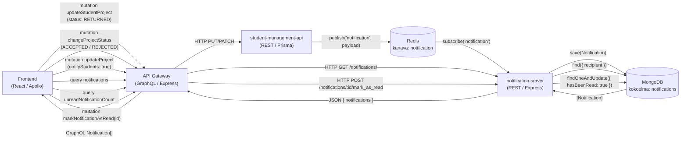
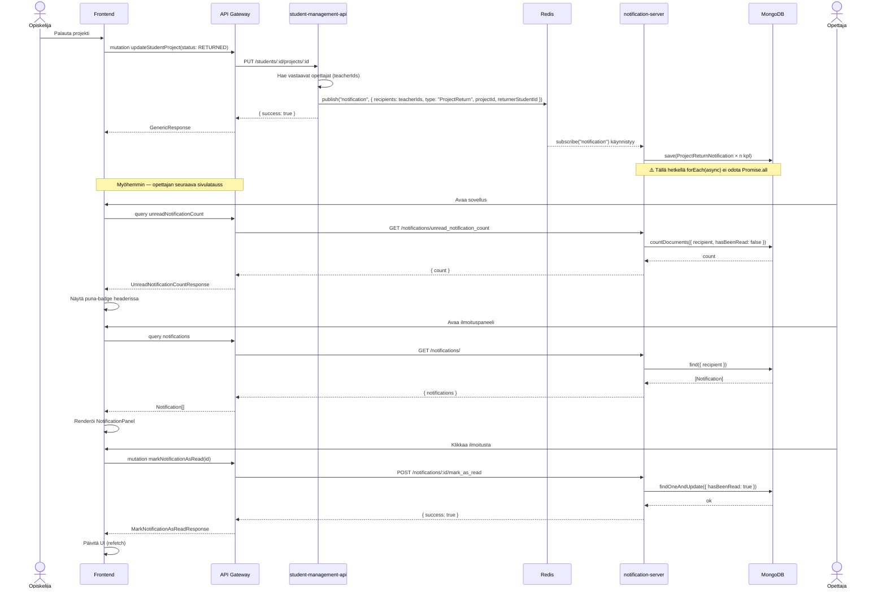
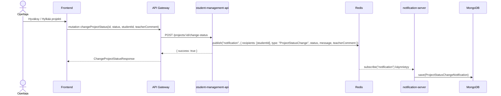
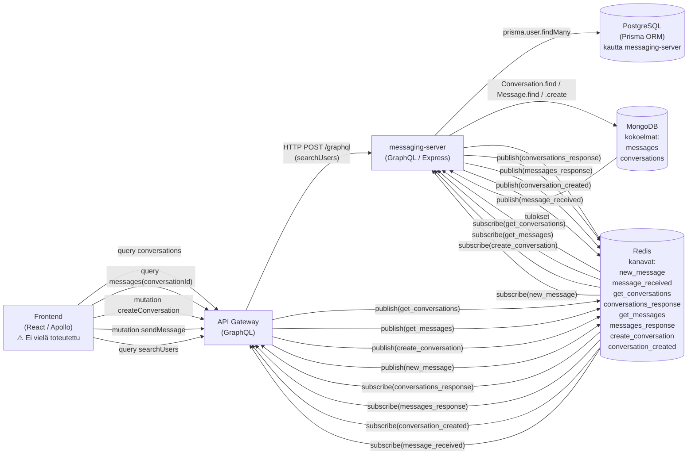
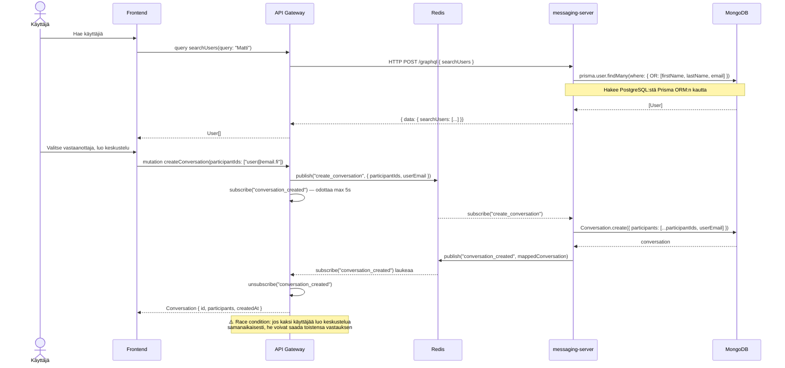
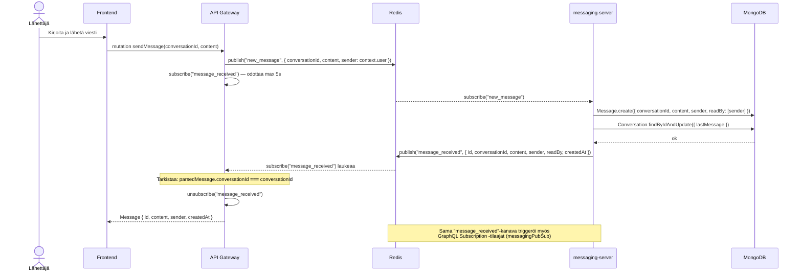
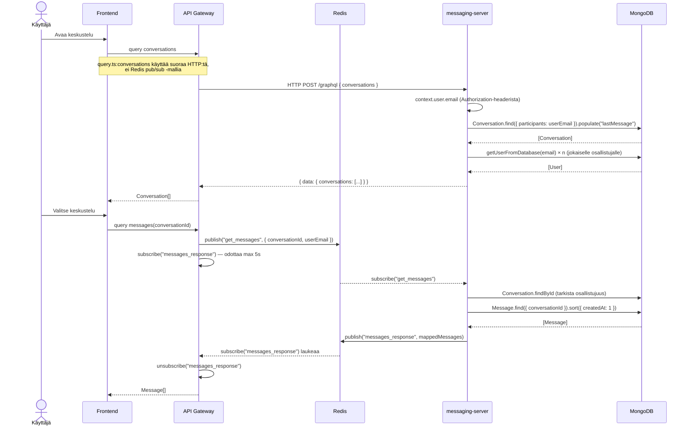

# Notifikaatio- ja viestintäjärjestelmän kaaviot

## 1. Notifikaatiojärjestelmä

### 1.1 Datavirta

### 1.2 Sekvenssikaavio — opiskelija palauttaa projektin

### 1.3 Sekvenssikaavio — opettaja muuttaa projektin statuksen

---

## 2. Viestintäjärjestelmä

### 2.1 Datavirta

### 2.2 Sekvenssikaavio — uuden keskustelun aloitus

### 2.3 Sekvenssikaavio — viestin lähetys

### 2.4 Sekvenssikaavio — keskusteluhistorian haku

---

## 3. Yhteenveto — tunnistetut ongelmat

| # | Järjestelmä | Ongelma | Vakavuus |
|---|-------------|---------|----------|
| 1 | Notifikaatiot | `forEach(async)` ei odota tallennuksia — käytä `Promise.all` | Keski |
| 2 | Notifikaatiot | Ei reaaliaikaista push-ilmoitusta, vain polling | Matala |
| 3 | Viestit | Redis pub/sub request-reply on race condition -altis | **Korkea** |
| 4 | Viestit | `markMessageAsRead` resolver puuttuu API Gatewaystä | Keski |
| 5 | Viestit | Frontend chat-UI puuttuu kokonaan | **Korkea** |
| 6 | Viestit | GraphQL Subscriptions ei toimi (ei WS-tukea gatewayssä) | Keski |
| 7 | Viestit | `conversation(id)` query puuttuu API Gateway resolverista | Matala |
